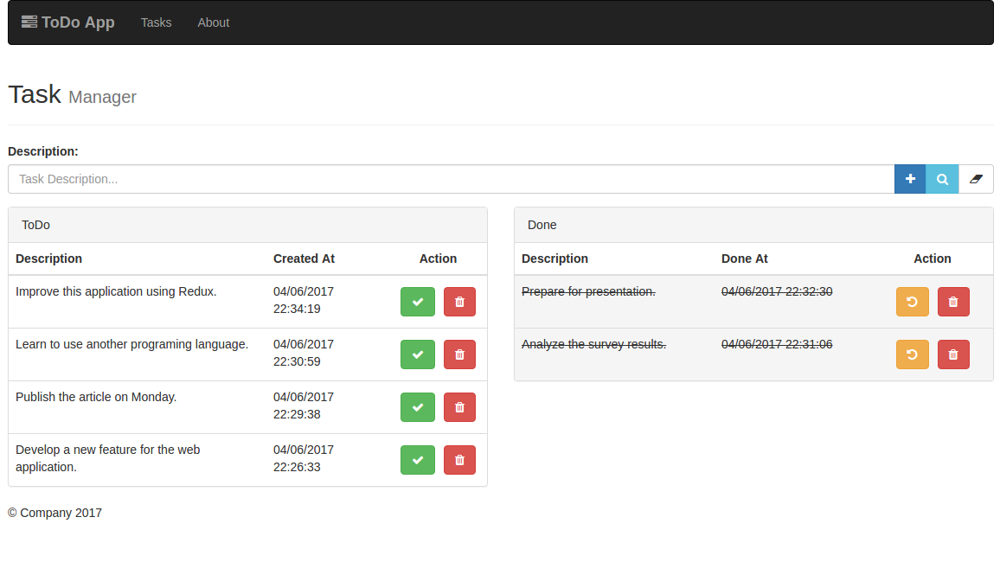

# ToDo App
A simple task application



### Using
- NodeJS
- MongoDB
- React
- Redux

### Instalation
```
npm i
```

### Backend Dependencies (Service:3003)
- body-parser
- express
- mongoose
- node-restful
- nodemon
- pm2

### Backend Run
```
npm run dev
```
or
```
npm run prod
```

### Frontend Dependencies (App:8080)
- axios
- babel-core
- babel-loader
- babel-plugin-react-html-attrs
- babel-plugin-transform-object-rest-spread
- babel-preset-es2015
- babel-preset-react
- bootstrap
- css-loader
- dateformat
- extract-text-webpack-plugin
- file-loader
- font-awesome
- google-maps
- jquery
- react
- react-dom
- react-redux
- react-router
- redux
- redux-multi
- redux-promise
- redux-thunk
- style-loader
- webpack
- webpack-dev-server

### Frontend Run
```
npm run dev
```
or
```
npm run prod
```
